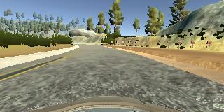
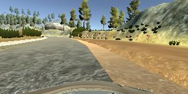
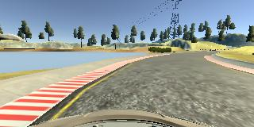
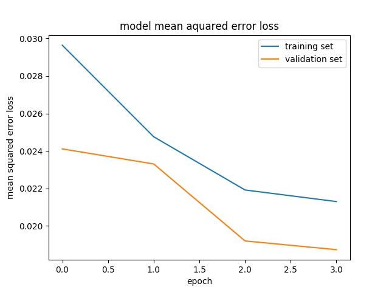

# **Behavioral Cloning** 

## Writeup Template


---

**Behavioral Cloning Project**

The goals / steps of this project are the following:
* Use the simulator to collect data of good driving behavior
* Build, a convolution neural network in Keras that predicts steering angles from images
* Train and validate the model with a training and validation set
* Test that the model successfully drives around track one without leaving the road
* Summarize the results with a written report

## Rubric Points
### Here I will consider the [rubric points](https://review.udacity.com/#!/rubrics/432/view) individually and describe how I addressed each point in my implementation.  

---
### Files Submitted & Code Quality

#### 1. Submission includes all required files and can be used to run the simulator in autonomous mode

My project includes the following files:
* model.py containing the script to create and train the model
* drive.py for driving the car in autonomous mode
* model.h5 containing a trained convolution neural network 
* writeup_report.md summarizing the results

#### 2. Submission includes functional code
Using the Udacity provided simulator and my drive.py file, the car can be driven autonomously around the track by executing 
```sh
python drive.py model.h5
```

#### 3. Submission code is usable and readable

The model.py file contains the code for training and saving the convolution neural network. The file shows the pipeline I used for training and validating the model, and it contains comments to explain how the code works.

### Model Architecture and Training Strategy

#### 1. An appropriate model architecture has been employed

My model consists of a convolution neural network with 5x5/3x3 filter sizes and depths between 24 and 64 (model.py lines 75-79) 

The model includes RELU layers to introduce nonlinearity (code line 75-79), and the data is normalized in the model using a Keras lambda layer (code line 73). 

#### 2. Attempts to reduce overfitting in the model

The model use data augmentation in order to reduce overfitting (model.py lines 42-55). Such as collecte more data and multiple cameras and flip the images 

The model was trained and validated on different data sets to ensure that the model was not overfitting (code line 42-55). The model was tested by running it through the simulator and ensuring that the vehicle could stay on the track.

#### 3. Model parameter tuning

The model used an adam optimizer, so the learning rate was not tuned manually (model.py line 87).

#### 4. Appropriate training data

Training data was chosen to keep the vehicle driving on the road. I used a combination of center lane driving, recovering from the left and right sides of the road.

For details about how I created the training data, see the next section. 

### Model Architecture and Training Strategy

#### 1. Solution Design Approach

The overall strategy for deriving a model architecture was to follow the architecture published by autonomous vehicle team at NVIDIA.

My first step was to use a convolution neural network model similar to the LeNet, I thought this model might be appropriate because the results was good.

In order to gauge how well the model was working, I split my image and steering angle data into a training and validation set. I found that my first model had a low mean squared error on the training set but a high mean squared error on the validation set. This implied that the model was overfitting. 

To combat the overfitting, I use the data augmentation so that I can get more data by multiple cameras and flipping images.

Then I train the model.

The final step was to run the simulator to see how well the car was driving around track one. There were a few spots where the vehicle fell off the track... to improve the driving behavior in these cases, I collect the data at the spots where the vehicle fell off the track, jusr record  data when the car is driving from the side of the road back toward the center line.

At the end of the process, the vehicle is able to drive autonomously around the track without leaving the road.

#### 2. Final Model Architecture

The final model architecture (model.py lines 72-84) consisted of a convolution neural network with the following layers: Flatten layer and Full connect layes of 100/50/10/1.


#### 3. Creation of the Training Set & Training Process

To capture good driving behavior, I first recorded two laps on track one using center lane driving. Here is an example image of center lane driving:



I then recorded the vehicle recovering from the left side and right sides of the road back to center so that the vehicle would learn to recover, These images show what a recovery looks like. :




After the collection process, I had X number of data points. I then preprocessed this data by normalize this data and crop the images.


I finally randomly shuffled the data set and put 20% of the data into a validation set. 

I used this training data for training the model. The validation set helped determine if the model was over or under fitting. The ideal number of epochs was 4, I used an adam optimizer so that manually training the learning rate wasn't necessary.

